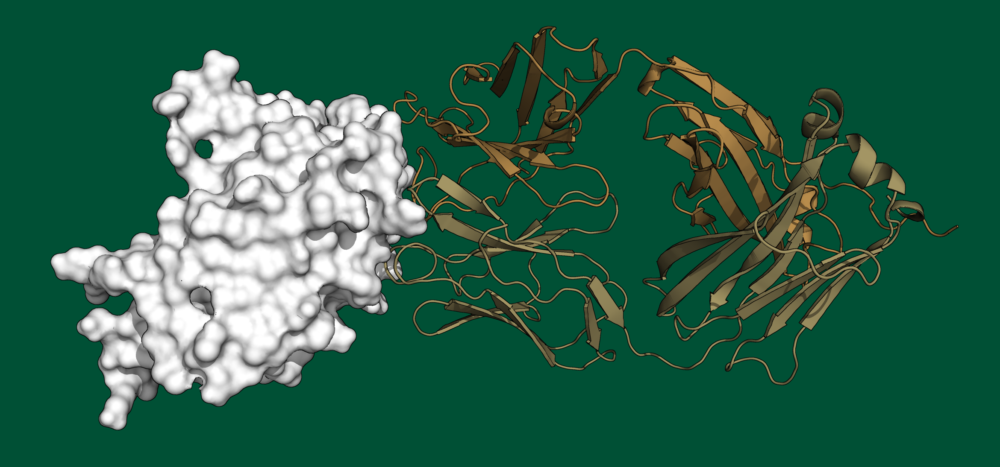
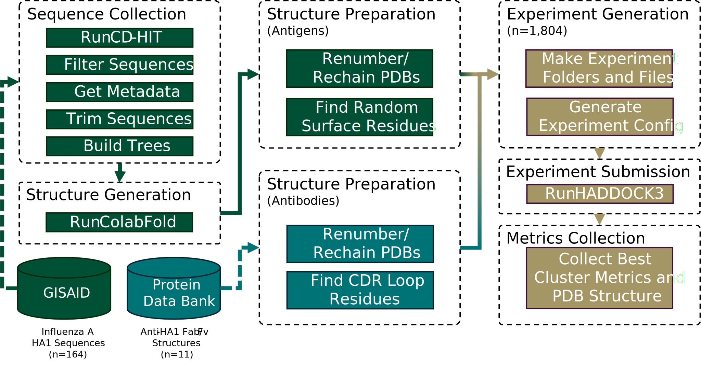

# Large-Scale Computational Modeling of H5 Influenza Variants Against HA1-Neutralizing Antibodies

<h3 align="right">Colby T. Ford, Shirish Yasa, Khaled Obeid, Sayal Guirales-Medrano,  Richard Allen White III, and Daniel Janies</h3>

## Data

### Outputs:

- Docking metrics, antigen/antibody metadata, and clustering results: [Experiments.xlsx](Experiments.xlsx)
- Docked structures ($n=1,804$): [data/results](data/results)
- Phylogenetic Tree: [tree0.tnt.nex](scripts/7_analyses/phylogenetics/18k_tree/tree0.tnt.nex)

### Inputs:

- Antigens ($n=164$):
    - Input Sequences: [data/sequences](data/sequences)
    - Predicted Structures: [data/structures/antigens/HA1](data/structures/antigens/HA1)
- Antibodies ($n=11$):
    - Structures: [data/structures/antibodies](data/structures/antibodies)

## Workflow

### Scripts

0. Sequence Collection: [0_sequence_collection](scripts/0_sequence_collection)
1. Structure Generation with ColabFold: [1_structure_generation](scripts/1_structure_generation)
2. PDB Structure Preparation: [2_structure_prep](scripts/2_structure_prep)
3. HADDOCK3 Experiment Generation: [3_experiment_generation](scripts/3_experiment_generation)
4. HPC Experiment Submission: [4_experiment_submission](scripts/4_experiment_submission)
5. Cleanup: [5_cleanup](scripts/5_cleanup)
6. Metrics Collection: [6_metrics_collection](scripts/6_metrics_collection)
7. Analyses: [7_analyses](scripts/7_analyses)
    - Statistics: [7_analyses/statistics](scripts/7_analyses/statistics)
    - Structure Analyses: [7_analyses/statistics](scripts/7_analyses/structure_analyses)
    - Phylogenetics: [7_analyses/phylogenetics](scripts/7_analyses/phylogenetics)
    - _GIRAF_ Graph Analyses: [scripts/7_analyses/giraf](scripts/7_analyses/giraf)

